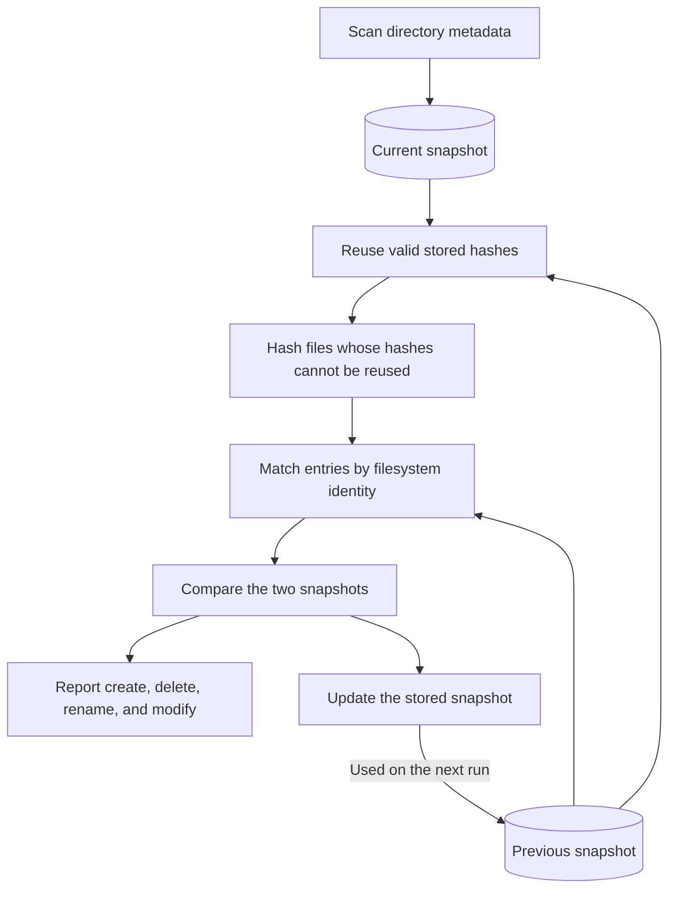
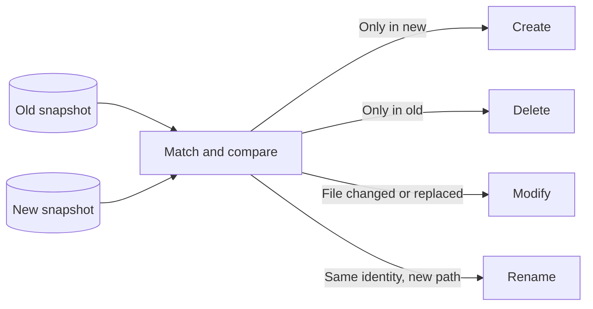

# Directory Snapshot Scanner

## Assignment

Create a Python script that scans a given directory and stores its structure in
a relational database so that the database always represents the latest state.
The script must support repeated execution and detect:

- file creation (`create`);
- file deletion (`delete`);
- file renaming (`rename`);
- file content modification (`modify`).

The solution should be designed with performance in mind because a real
directory can contain millions of files and grow dynamically. Change history is
not required; only the current state must be preserved. The preferred target
operating system is Windows.

## Solution

A Python script that recursively scans a directory and stores its current state
in SQLite. Repeated runs compare the previous state with the latest scan and
detect created, deleted, modified, and renamed entries.

The project uses only the Python standard library and is intended to work on
Windows, macOS, and Linux.

## Project structure

```text
ESET_solution/
├── main.py       # Small command-line entry point
├── cli.py        # Arguments and terminal output
├── scanner.py    # Iterative filesystem traversal
├── hashing.py    # BLAKE2b content hashing
├── database.py   # SQLite snapshots and transactions
├── changes.py    # Change detection and entity matching
├── models.py     # Shared result dataclasses and types
└── tests/
    ├── support.py                # Shared test setup
    ├── test_snapshot.py          # Change detection and database safety
    ├── test_scanner.py           # Traversal and link handling
    ├── test_hashing.py           # Stable file hashing
    └── test_parallel_hashing.py  # Worker and rollback behavior
```


## How it works



The scanner uses `os.scandir()` and a stack. It builds relative paths as it
scans. Symbolic links and Windows junctions are saved but not followed, and
directory identities help prevent cycles.

Hashes are reused when file metadata and filesystem identity have not changed.
Fewer than 256 files are hashed one by one. Larger workloads use four workers
and batches of 128 paths. Workers only hash files; the main thread handles
SQLite.

Filesystem identities help detect renames. SQLite compares the old and new
snapshots to find created, deleted, renamed, and modified entries. It updates
only changed rows.

The update runs in one transaction. If the scan detects a filesystem change,
it retries once. Any failure rolls back the update and keeps the previous
snapshot.

## Algorithms

- **Directory scan:** iterative DFS traversal with `os.scandir()` and a
  LIFO stack.
- **Cycle protection:** visited directory identities prevent repeated traversal;
  symbolic links and Windows junctions are not followed.
- **Content hashing:** BLAKE2b reads exactly the descriptor-reported file size
  in chunks of at most 1 MiB and uses constant memory. Valid hashes of unchanged
  files are reused. Workloads of at least 256 files use four hashing workers and
  bounded batches of 128 paths.
- **Entity matching:** unique `(device_id, file_id)` pairs identify renames.
  Remaining regular files at the same path are matched as updates; ambiguous
  hard-link renames are handled conservatively.
- **Change detection:** set-based SQLite queries find create, delete, modify,
  and rename events.
- **Snapshot update:** only changed persistent rows are deleted or replaced.

## Change detection



- **Create:** an entry exists only in the new snapshot.
- **Delete:** an entry exists only in the old snapshot.
- **Modify:** a matched file has different content, or a new reliable
  filesystem identity shows that it was replaced at the same path. Hashes are
  used when available; file size and modification time are the fallback.
- **Rename:** the same unique, non-zero filesystem identity has a new path.

Rename detection avoids guessing. If one filesystem identity has several
paths, as with hard links, the script reports create and delete changes instead.

A regular file replaced at the same path is reported as modify when its content
or reliable filesystem identity changed. Changing a path between a file and a
directory is reported as delete and create. A renamed and changed file produces
both rename and modify. Moving a directory reports one directory rename without
repeating every child path.

## Database

The persistent `entries` table stores:

| Column | Description |
|---|---|
| `path` | Path relative to the scanned root |
| `parent_path` | Relative parent path |
| `name` | File or directory name |
| `entry_type` | `file`, `directory`, `symlink`, `junction`, or another type |
| `size` | Size in bytes |
| `modified_ns` | Modification time in nanoseconds |
| `device_id` | Filesystem device identifier stored as decimal text |
| `file_id` | Filesystem entry identifier stored as decimal text |
| `content_hash` | BLAKE2b-256 digest for regular files, stored as a BLOB |

`scan_metadata` binds the database to one canonical scanned root. The database
keeps the latest directory state, not a history of changes.

Temporary tables are used only while one scan is running:

- `entries_snapshot` stores the new directory state.
- `reusable_hashes` stores old hashes that are safe to reuse.
- `files_to_hash` stores paths that still need hashing.
- `entity_matches` connects old entries with new entries.
- `detected_changes` stores the changes found during comparison.
- `entries_to_write` stores paths that must be updated in `entries`.

Three named indexes keep database lookups fast:

- `idx_entries_file_identity` finds stored entries by filesystem identity.
- `idx_entries_snapshot_identity` does the same for the new snapshot.
- `idx_detected_changes_path` speeds up filtering and ordering detected changes.


## Requirements

- Python 3.9 or later.
- Windows, macOS, or Linux.
- No third-party dependencies (`requirements.txt` is intentionally empty).

## Setup and usage

### Windows PowerShell

1. Open PowerShell and go to the repository:

   ```powershell
   cd "C:\path\to\ESET_task"
   ```

2. Check that Python is installed:

   ```powershell
   python --version
   ```

3. Create and activate a virtual environment:

   ```powershell
   python -m venv ESET_solution\.venv
   .\ESET_solution\.venv\Scripts\Activate.ps1
   ```


4. Scan the supplied sample after extracting it to `folder` in the repository:

   ```powershell
   python .\ESET_solution\main.py .\folder
   ```

5. Scan another directory and choose a database location:

   ```powershell
   python .\ESET_solution\main.py "C:\Data\Files" --database "C:\Data\snapshot.db"
   ```

### macOS and Linux

1. Open a terminal and go to the repository:

   ```bash
   cd "/path/to/ESET_task"
   ```

2. Check Python, then create and activate a virtual environment:

   ```bash
   python3 --version
   python3 -m venv ESET_solution/.venv
   source ESET_solution/.venv/bin/activate
   ```

3. Scan the supplied sample or another directory:

   ```bash
   python ESET_solution/main.py folder
   python ESET_solution/main.py "/path/to/files" --database "/path/to/snapshot.db"
   ```

### Common options

Without `--database`, the state is stored in
`ESET_solution/scan_result.db`. The database must be outside the scanned
directory, and each database can be used with only one scanned root.

Show at most five detected changes:

```bash
python ESET_solution/main.py folder --show-changes 5
```

Display all command-line options:

```bash
python ESET_solution/main.py --help
```

Example summary:

```text
Directory snapshot updated
==========================
Folder   : /path/to/folder
Database : /path/to/state.db
Duration : 2.50 s
Entries  : 49,102

Changes
--------------------------
Created  : 0
Deleted  : 0
Modified : 0
Renamed  : 0
Total    : 0

No changes detected.
```

Expected input, filesystem, and database errors are printed as a short message
to standard error, and the process exits with status code `1`.

## Tests

Run the tests from the solution directory:

```bash
cd ESET_solution
python -m unittest discover -s tests -t . -v
```


## Hashing and performance

The first scan hashes every regular file. Later scans reuse a stored hash when
the filesystem identity, size, and modification time are unchanged. Hashes can
also be reused after a rename when the filesystem identity is unique. Files
whose previous hash cannot be safely reused are hashed again.

Files are read in chunks of up to 1 MiB, so memory use stays low. The hasher
reads the expected file size and checks the file before and after reading. If
the file changes or ends early, hashing is retried once.

For large workloads, four workers hash files in small batches. Workers never
use SQLite; the main thread performs all database reads and writes. If a worker
fails, pending work is cancelled and the scan is rolled back or retried.

The first scan reads every file. Later scans check every entry, but read file
content only when a new hash is needed.

## Complexity and scaling

- Scanning is `O(N)`, where `N` is the number of filesystem entries.
- The first scan is `O(N + B)`, where `B` is the total number of file bytes.
- Later scans are `O(N + R)`, where `R` is the number of bytes that need a new
  hash.
- SQLite uses indexed, set-based queries instead of pairwise Python
  comparisons.
- File records are streamed into SQLite, and parallel hashing is limited to
  batches of 128 paths. Python keeps directory identities for cycle protection
  but does not keep the full file list in memory.


## Known limitations

- A scan is not a perfect filesystem snapshot. If a file changes during the
  scan, the script retries once. A later change may be found on the next run.
- An in-place content change can be missed if the file keeps the same size and
  its old modification time is restored.
- Hard links share the same filesystem identity. If a rename is unclear, the
  script reports a create and delete instead.
- One database can track only one root directory. Use a separate database for
  another directory.

## Performance measurements

This benchmark used 10,000 files of 1 KiB in 100 directories. Creating the test
files was not included in the measured time, and the database was kept outside
the scanned directory. The Windows time is the middle result from three runs on
an Intel Core i5-1145G7 with Python 3.14.7. The macOS ARM64 results come from an
older version before the latest speed improvements, so they are shown only for
comparison.

| Scenario | Entries | Result | Windows current | macOS ARM64 reference |
|---|---:|---|---:|---:|
| First scan | 10,100 | 10,100 created | 1.51 s | 0.91 s |
| Unchanged scan | 10,100 | No changes | 0.83 s | 0.28-0.29 s |
| 100 files changed from 1 KiB to 2 KiB | 10,100 | 100 modified | 0.82 s | 0.29 s |

