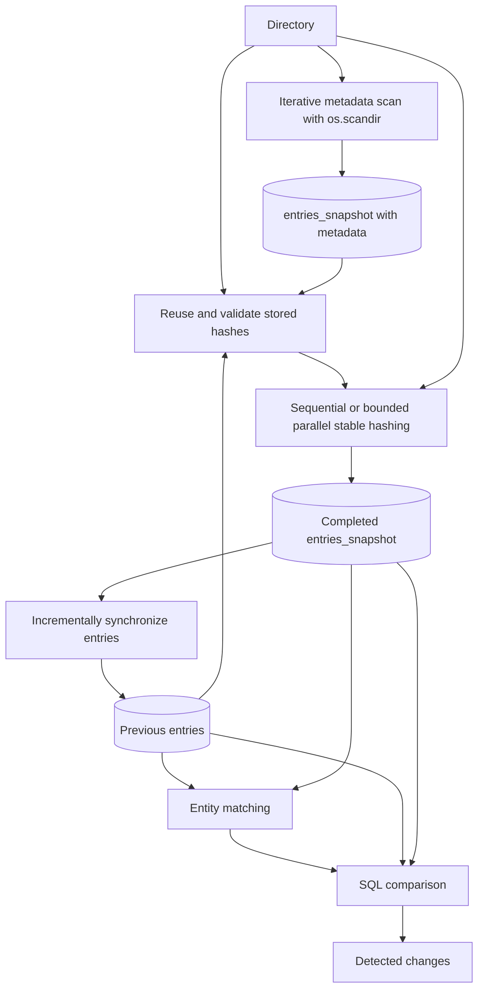
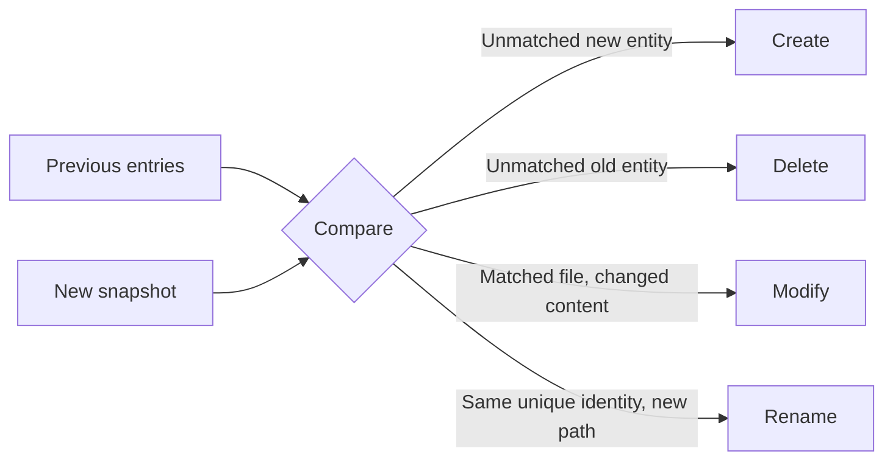

# Directory Snapshot Scanner

## Assignment

Create a Python script that scans a given directory and stores its structure in
a relational database so that the database always represents the latest state.
The script must support repeated execution and detect:

- file creation (`create`);
- file deletion (`delete`);
- file renaming (`rename`);
- file content modification (`modify`).

The solution should be designed with performance in mind because a real
directory can contain millions of files and grow dynamically. Change history is
not required; only the current state must be preserved. The preferred target
operating system is Windows.

## Solution

A Python script that recursively scans a directory and stores its current state
in SQLite. Repeated runs compare the previous state with the latest scan and
detect created, deleted, modified, and renamed entries.

The project uses only the Python standard library and is intended to work on
Windows, macOS, and Linux.

## Project structure

```text
ESET_solution/
├── main.py       # Small command-line entry point
├── cli.py        # Arguments and terminal output
├── scanner.py    # Iterative filesystem traversal
├── hashing.py    # Stable BLAKE2b content hashing
├── database.py   # SQLite snapshots and transactions
├── changes.py    # Change detection and entity matching
├── models.py     # Shared result dataclasses and types
└── tests/        # Automated behavior tests
```


## How it works



The scanner uses an explicit LIFO stack instead of recursion. Each pending
directory carries both its absolute and relative path, so child paths are built
directly without repeatedly normalizing the complete path.
Symbolic links and Windows junction/reparse directories are stored as entries
but never traversed. A visited-directory identity set provides an additional
cycle guard.
Fewer than 256 files are hashed sequentially. Larger workloads are fetched from
SQLite in batches of 128 paths and sent to four `ThreadPoolExecutor` workers.
Workers only read and hash files; the main thread collects each complete batch
and performs all SQLite updates.
The database update runs in a transaction. An observed filesystem race causes
one complete retry. If the retry or another operation fails, the previous valid
snapshot remains unchanged.

## Algorithms

- **Directory scan:** iterative depth-first traversal with `os.scandir()` and a
  LIFO stack, without Python recursion or per-entry `os.path.relpath()` calls.
- **Cycle protection:** visited directory identities prevent repeated traversal;
  symbolic links and Windows junctions are not followed.
- **Content hashing:** BLAKE2b reads exactly the descriptor-reported file size
  in chunks of at most 1 MiB and uses constant memory. Valid hashes of unchanged
  files are reused. Workloads of at least 256 files use four hashing workers and
  bounded batches of 128 paths.
- **Entity matching:** unique `(device_id, file_id)` pairs identify renames;
  ambiguous hard links are handled conservatively.
- **Change detection:** set-based SQLite queries find create, delete, modify,
  and rename events.
- **Snapshot update:** only changed persistent rows are deleted or replaced.

## Change detection



- **Create:** a new entity cannot be matched to a previous entity.
- **Delete:** a previous entity cannot be matched to a new entity.
- **Modify:** a matched regular file has different content. When both hashes
  are available, they are authoritative; otherwise size and modification time
  are used as a fallback.
- **Rename:** one unique, non-zero filesystem identity has a different path.

Rename detection is intentionally conservative. If an identity appears more
than once, as can happen with hard links, the script reports path-based create
and delete changes instead of guessing which path was renamed.

A reliable identity changing at the same path is represented as a delete and a
create. A renamed file whose content also changed produces both rename and
modify. A directory-tree move is shown as one directory rename; descendant path
changes implied by that move are not repeated in the terminal result.

## Database

The persistent `entries` table stores:

| Column | Description |
|---|---|
| `path` | Path relative to the scanned root |
| `parent_path` | Relative parent path |
| `name` | File or directory name |
| `entry_type` | `file`, `directory`, `symlink`, `junction`, or another type |
| `size` | Size in bytes |
| `modified_ns` | Modification time in nanoseconds |
| `device_id` | Filesystem device identifier stored as decimal text |
| `file_id` | Filesystem entry identifier stored as decimal text |
| `content_hash` | BLAKE2b-256 digest for regular files, stored as a BLOB |

`entries_snapshot`, `entity_matches`, and `detected_changes` are temporary
SQLite tables used only during a scan. `scan_metadata` binds the database to one
canonical scanned root. The database keeps the latest directory state, not a
history of changes.

The persistent table is synchronized incrementally. An unchanged scan compares
all staged rows but does not delete and reinsert all persistent rows.
Text storage safely represents Windows file IDs up to 128 bits without SQLite
integer overflow. Existing databases from older development versions are not
supported; use a new database file with this submission.

## Requirements

- Python 3.9 or newer.
- No third-party packages; `requirements.txt` contains no packages to install.
- Windows, macOS, or Linux.

## Setup and usage

Create and activate a virtual environment on macOS or Linux:

```bash
python3 -m venv ESET_solution/.venv
source ESET_solution/.venv/bin/activate
```

On Windows PowerShell:

```powershell
py -m venv ESET_solution\.venv
ESET_solution\.venv\Scripts\Activate.ps1
```

Scan the supplied sample directory using the default database after extracting
it to `folder/` at the repository root:

```bash
python ESET_solution/main.py folder
```

Scan another directory:

```bash
python ESET_solution/main.py /path/to/folder --database /path/to/state.db
```

The SQLite database must be outside the scanned directory. Reusing an existing
database for a different scanned root is rejected.

Show at most five detected changes:

```bash
python ESET_solution/main.py folder --show-changes 5
```

### Hashing strategy

The first scan hashes every regular file. Later scans reuse a stored hash when
the file identity, size, and modification time are unchanged. A hash can also
be reused after a rename when the filesystem identity is unique. New and
metadata-changed files are hashed again.

This single strategy balances content-based modification detection with the
performance required for large directory trees. Like any metadata shortcut, it
cannot detect a same-size content change when the modification time is also
deliberately restored to its previous value.

Example summary:

```text
Directory snapshot updated
==========================
Folder   : /path/to/folder
Database : /path/to/state.db
Duration : 2.50 s
Entries  : 49,102

Changes
--------------------------
Created  : 0
Deleted  : 0
Modified : 0
Renamed  : 0
Total    : 0

No changes detected.
```

Display all command-line options:

```bash
python ESET_solution/main.py --help
```

Expected input, filesystem, and database errors are printed as a short message
to standard error, and the process exits with status code `1`.

## Tests

Run the tests from the solution directory:

```bash
cd ESET_solution
python -m unittest discover -s tests -v
```

Tests cover create, delete, content modification, rename collisions and swaps,
same-path replacement, directory-tree renames, hard-link ambiguity, hash reuse,
database root binding, incremental writes, retry behavior, input validation,
stable hashing, size-bounded reads, direct relative-path construction,
bounded parallel hashing, worker-failure rollback, Windows-sized file IDs,
junction handling, and transaction rollback.

## Stable hashing and performance

Regular files are read in 1 MiB chunks, so hashing uses constant memory. The
size returned by the first `os.fstat()` is used as the exact byte budget. This
supports partial reads without issuing an additional read only to discover EOF;
an unexpected early EOF leaves the budget incomplete and causes a retry.
Before and after reading, the hasher verifies file type, device ID, file ID,
size, and modification time using `os.fstat()` and a final `os.stat(path)`. On
non-Windows systems it also checks `ctime`; modern Python versions can report
inconsistent path and descriptor `ctime` values on Windows. The final path
check catches a file being replaced while its old open descriptor remains
readable. An unstable file is retried once; the complete directory scan is then
retried once before the transaction is aborted.

Parallel hashing never shares the SQLite connection with worker threads. The
main thread reads one bounded path batch, workers call only the stable hashing
function, and the main thread applies the completed batch with `executemany()`.
If a worker fails, pending work in that batch is cancelled and the exception is
propagated into the existing savepoint rollback and full-scan retry.

No userspace scanner can eliminate a filesystem race after its final metadata
check. The first scan takes approximately
`O(number of entries + total file bytes)`. Later scans take approximately
`O(number of entries + bytes of files that need a new hash)`. Unchanged files
are checked with metadata and do not need to be read again.

## Known limitations

- A userspace filesystem snapshot is not fully atomic. The scanner retries
  observed races, but a change can still happen after the final metadata check.
- A same-size content change can be missed if its modification time is also
  restored, because the stored hash is considered reusable.
- Hard links share one filesystem identity, so ambiguous hard-link changes are
  reported conservatively as create and delete instead of a guessed rename.
- Each SQLite database is bound to one root directory. A different root needs
  a separate database file.

## Performance measurements

The following local benchmark used 10,000 files of 1 KiB each, distributed
across 100 directories. The database was stored outside the scanned directory,
and dataset generation was excluded. The current Windows results are medians
of three trials on an Intel Core i5-1145G7 with Python 3.14.7. The macOS ARM64
figures were recorded previously with Python 3.9.6, before the direct-path and
size-bounded-read and parallel-hashing optimizations, so they are included only
as a reference.

| Scenario | Entries | Result | Windows current | macOS ARM64 reference |
|---|---:|---|---:|---:|
| First scan | 10,100 | 10,100 created | 1.51 s | 0.91 s |
| Unchanged scan | 10,100 | No changes | 0.83 s | 0.28-0.29 s |
| 100 files changed from 1 KiB to 2 KiB | 10,100 | 100 modified | 0.82 s | 0.29 s |

The unchanged scan is faster because valid stored hashes are reused instead of
reading every file again. These numbers are illustrative: filesystem type,
storage speed, cache state, file sizes, antivirus software, and operating
system behavior can significantly affect real results.
